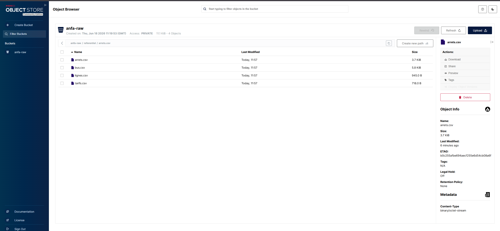

# Rendu Séance 1
**Nom et prénom :** GBOSSOU Folly S. Carlo

## Résumé de la séance

Cette première séance a posé la brique fondamentale du projet Anfa : un stockage objet local alimenté par Python. Après avoir vérifié l'installation de Docker et forké le dépôt du cours, nous avons lancé MinIO via `docker run`, créé le bucket `anfa-raw` et une paire de clés applicatives via le client `mc` embarqué dans le conteneur. Nous avons ensuite écrit un script Python (`upload_referentiel.py`) utilisant le SDK `boto3` pour déposer les quatre fichiers CSV du référentiel Anfa (lignes, arrêts, bus, tarifs) dans le bucket. La séance s'est conclue par une introduction au fichier `docker-compose.yml` comme alternative lisible et versionnable à la commande `docker run`.

## Étapes principales

1. **Vérification de l'environnement** : `docker --version` et `docker compose version` confirment Docker ≥ 24 et Compose ≥ 2.20.
2. **Fork et clone** : fork du dépôt `denisakp/cloud-bigdata-anfa-resources`, clone local, création de la branche `seance-01` et du dossier `seance-01/`.
3. **Lancement de MinIO** : `docker run` avec les options `-d`, `--name`, `-p`, `-v`, `-e` pour démarrer MinIO en arrière-plan avec un volume persistant.
4. **Administration via `mc`** : entrée dans le conteneur (`docker exec -it`), configuration de l'alias `local`, création du bucket `anfa-raw`, création de la clé applicative `anfa-app-key`.
5. **Environnement Python** : création du virtualenv `.venv`, installation de `boto3` via `requirements.txt`.
6. **Script d'upload** : écriture de `upload_referentiel.py` — connexion au client S3 MinIO, vérification du bucket, upload des quatre CSV sous le préfixe `referentiel/`, listing du contenu.
7. **Création du `docker-compose.yml`** : équivalent YAML de la commande `docker run`, prêt pour la séance 2.

## Capture d'écran



*Console MinIO (`http://localhost:9101`) — bucket `anfa-raw`, préfixe `referentiel/` avec les quatre CSV.*

## Difficultés rencontrées

Le script `upload_referentiel.py` échouait au démarrage avec `EndpointConnectionError: Could not connect to the endpoint URL: "http://localhost:9000/anfa-raw"`. Le TP indique les ports `-p 9000:9000 -p 9001:9001`, mais le conteneur sur cette machine a été lancé avec `-p 9100:9000 -p 9101:9001` (les ports 9000 et 9001 de l'hôte étaient déjà occupés). La correction a consisté à remplacer `MINIO_ENDPOINT = "http://localhost:9000"` par `"http://localhost:9100"` dans le script.

---

## Exercices d'application

### Exercice 1 : QCM conceptuel

**1.1** Réponse : **D. Open source obligatoire**

Le NIST définit cinq caractéristiques essentielles du cloud : libre-service à la demande, large accès réseau, mutualisation des ressources, élasticité rapide et service mesuré. Le recours à l'open source n'en fait pas partie — un fournisseur peut proposer un cloud entièrement propriétaire et respecter quand même toutes ces caractéristiques.

---

**1.2** Réponse : **C. SaaS**

Gmail est une application de messagerie complète, hébergée et maintenue par Google, accessible via navigateur sans aucune installation locale ni gestion d'infrastructure de la part de l'utilisateur — définition exacte du Software as a Service.

---

**1.3** Réponse : **D. FaaS**

Le Function as a Service (ex. AWS Lambda, Google Cloud Functions) permet d'exécuter une fonction en réponse à un événement (ici, l'arrivée d'une position GPS) en quelques millisecondes, sans serveur dédié tournant en permanence et avec une facturation à l'invocation.

---

**1.4** Réponse : **C. Cloud hybride**

Le cloud hybride combine un cloud privé (où les données sensibles soumises à la réglementation restent sous contrôle total) et un cloud public (qui fournit l'élasticité de calcul pour les analyses non sensibles), répondant simultanément aux deux contraintes.

---

**1.5** Réponse : **B. La situation où une entreprise ne peut plus changer de fournisseur sans coûts ou risques majeurs**

Le vendor lock-in désigne la dépendance technologique, contractuelle ou opérationnelle qui rend la migration vers un autre fournisseur prohibitivement coûteuse ou risquée (formats propriétaires, APIs spécifiques, coûts de sortie des données, réécriture des intégrations).

---

**1.6** Réponse : **C. Un service open source est forcément moins performant qu'un service managé propriétaire**

Cette affirmation est fausse : de nombreux services managés propriétaires (Amazon S3, Google BigQuery, Azure HDInsight) reposent eux-mêmes sur des briques open source (MinIO, Apache Beam, Apache Hadoop). Les performances dépendent de l'architecture, des SLA et de l'optimisation, pas du modèle de licence.

---

### Exercice 2 : Classification de services

| Service | Modèle | Justification |
|---|---|---|
| Google Compute Engine (machine virtuelle) | **IaaS** | Fournit des VM brutes que l'utilisateur configure, administre et maintient lui-même — seule l'infrastructure physique est mutualisée. |
| AWS Lambda | **FaaS** | Exécute du code en réponse à des événements sans aucun serveur dédié, facturation à la milliseconde d'exécution. |
| Snowflake (entrepôt de données) | **SaaS** | Entrepôt de données entièrement managé accessible via interface web ou JDBC sans aucune gestion de cluster ou de stockage sous-jacent. |
| Heroku | **PaaS** | Plateforme qui gère automatiquement le déploiement, la mise à l'échelle et l'infrastructure ; le développeur ne dépose que son code. |
| Microsoft 365 (Word, Excel en ligne) | **SaaS** | Suite bureautique complète consommée via navigateur, maintenue et mise à jour entièrement par Microsoft. |
| Databricks (Spark managé) | **PaaS** | Plateforme de traitement de données qui provisionne et gère les clusters Spark ; l'utilisateur écrit des notebooks sans toucher à l'infrastructure. |
| Microsoft Azure Functions | **FaaS** | Fonctions événementielles sans serveur dédié sur Azure, même modèle qu'AWS Lambda. |
| Tableau Online | **SaaS** | Outil de visualisation hébergé et maintenu par Tableau/Salesforce, accessible via navigateur sans installation. |

---

### Exercice 3 : Lecture et interprétation

#### 3.1 Commande `docker run`

```bash
docker run -d --name analyse-anfa -p 8888:8888 -v /home/koffi/notebooks:/notebooks \
    -e JUPYTER_TOKEN=anfa-token \
    jupyter/pyspark-notebook
```

- `-d` : Lance le conteneur en mode **détaché** (arrière-plan) ; le terminal est libéré immédiatement après le démarrage.
- `--name analyse-anfa` : Attribue le nom `analyse-anfa` au conteneur pour pouvoir le référencer par ce nom dans les commandes ultérieures (`docker stop`, `docker logs`, etc.).
- `-p 8888:8888` : Mappe le port 8888 de la machine hôte vers le port 8888 du conteneur, rendant Jupyter accessible à `http://localhost:8888`.
- `-v /home/koffi/notebooks:/notebooks` : Monte le répertoire local `/home/koffi/notebooks` dans le conteneur au chemin `/notebooks` ; les notebooks créés dans le conteneur sont ainsi persistés sur la machine hôte.
- `-e JUPYTER_TOKEN=anfa-token` : Injecte la variable d'environnement `JUPYTER_TOKEN` avec la valeur `anfa-token`, qui sert de mot de passe pour accéder à l'interface Jupyter.
- `jupyter/pyspark-notebook` : L'image Docker à utiliser (téléchargée depuis Docker Hub), qui contient Python, Jupyter et PySpark pré-installés.

**La commande entière** lance un serveur Jupyter Notebook avec PySpark en arrière-plan, accessible depuis le navigateur sur le port 8888 avec le token `anfa-token`. Les notebooks sont stockés de façon persistante dans `/home/koffi/notebooks` sur la machine hôte, de sorte qu'ils survivent à la suppression du conteneur.

---

#### 3.2 Lecture du `docker-compose.yml`

**a. Adresses accessibles depuis le navigateur de l'hôte :**

- `http://localhost:9000` — API S3 (utilisée par les programmes et SDKs boto3/mc)
- `http://localhost:9001` — Console web d'administration MinIO

**b. Que se passe-t-il si on supprime le conteneur puis relance `docker compose up -d` ?**

Les données ne sont **pas perdues**. Elles sont stockées dans le volume Docker nommé `minio-data`, qui est géré indépendamment du cycle de vie du conteneur. Supprimer le conteneur avec `docker rm` ne supprime pas ce volume ; au relancement, Docker Compose recrée un nouveau conteneur `anfa-minio` qui se rattache au même volume `minio-data` existant et retrouve toutes les données déjà déposées.

**c. Problème de sécurité à corriger pour la production :**

Le mot de passe root `MINIO_ROOT_PASSWORD: secret` est trivial et stocké en clair dans le fichier `docker-compose.yml`, qui est lui-même versionné dans Git. En production, il faudrait externaliser les secrets — par exemple via un fichier `.env` non versionné référencé avec `env_file:`, un gestionnaire de secrets (HashiCorp Vault, Docker Secrets en mode Swarm) ou des variables d'environnement injectées par la CI/CD — et utiliser un mot de passe fort généré aléatoirement.

---

### Exercice 4 : Diagnostic

**a. Cause précise de l'erreur :**

Le script utilise `aws_access_key_id="anfa-admin"` et `aws_secret_access_key="anfa-password-2026"`, qui sont les **identifiants root** de l'interface d'administration de MinIO. Or l'API S3 de MinIO exige des **clés applicatives** (service account), créées séparément via `mc admin user svcacct add`. `anfa-admin` n'est pas enregistré comme access key S3 dans MinIO — d'où l'erreur `InvalidAccessKeyId`.

**b. Correction du code :**

Remplacer les identifiants root par les clés applicatives créées en partie 3.4 du TP :

```python
s3 = boto3.client(
    "s3",
    endpoint_url="http://localhost:9000",
    aws_access_key_id="anfa-app-key",        # clé applicative
    aws_secret_access_key="anfa-app-secret-2026",  # secret applicatif
    region_name="us-east-1",
)
```

**c. Pourquoi MinIO refuse ces identifiants via l'API S3 alors qu'ils fonctionnent sur la console web ?**

MinIO distingue deux couches d'authentification distinctes : la console web utilise un mécanisme de session HTTP classique (login/password via `/minio/login`) qui accepte les identifiants root (`MINIO_ROOT_USER` / `MINIO_ROOT_PASSWORD`). L'API S3, en revanche, implémente le protocole AWS Signature V4 qui repose exclusivement sur des paires **access key / secret key** enregistrées dans la base IAM interne de MinIO. Les identifiants root ne sont pas inscrits dans cette base S3 — ils pilotent uniquement la couche administration — d'où le refus systématique lorsqu'on les présente à l'API S3.

---

### Exercice 5 : Mini-cas d'architecture

**Contexte :** PME togolaise de e-commerce alimentaire à Lomé souhaitant moderniser son infrastructure data.

**a. Deux limites concrètes de l'architecture actuelle :**

1. **Granularité mensuelle incompatible avec le temps quasi-réel :** l'export CSV mensuel des commandes ne permet pas d'alimenter un modèle de prédiction horaire ; les données sont trop vieilles au moment du traitement.
2. **Ressources fixes et non partagées :** l'ordinateur portable de Toyi ne peut ni absorber les pics de charge (vendredi soir, fêtes) par manque de puissance de calcul, ni offrir un accès concurrent à plusieurs analystes depuis leurs propres postes.

---

**b. Besoins → caractéristiques NIST :**

| Besoin de la direction | Caractéristique NIST | Explication |
|---|---|---|
| Prédictions en quasi temps réel (chaque heure) | **Élasticité rapide** | Le cloud permet de provisionner des ressources de calcul supplémentaires en quelques minutes pour traiter un batch horaire, puis les libérer aussitôt. |
| Tableau de bord partagé sans installation locale | **Large accès réseau** | Les services cloud sont accessibles via internet depuis n'importe quel navigateur sur n'importe quel appareil, sans déploiement local. |
| Augmenter la capacité lors des pics | **Élasticité rapide** | Les ressources (CPU, mémoire) se provisionnent automatiquement à la hausse lors des vendredis soir et fêtes, puis se réduisent une fois le pic passé. |
| Maîtriser les coûts et portabilité inter-fournisseurs | **Service mesuré** | La facturation à l'usage (pay-as-you-go) évite l'investissement fixe surdimensionné et permet de comparer puis migrer vers un autre fournisseur à coût connu. |
| Données clients dans un environnement contrôlé | **Mutualisation des ressources** (avec isolation) | Un cloud privé ou hybride garantit que les données clients restent sur une infrastructure isolée et souveraine, tout en mutualisant les coûts d'hébergement. |

---

**c. Modèles de service pour chaque composant :**

- **(i) Tableau de bord partagé** → **SaaS** : une solution comme Metabase Cloud ou Tableau Online est accessible directement via navigateur sans installation, maintenue entièrement par le fournisseur. Les analystes ouvrent un URL et visualisent les données.

- **(ii) Calcul des prédictions à l'heure** → **FaaS** (ou PaaS selon l'échelle) : un FaaS (AWS Lambda, Google Cloud Functions) déclenche le calcul de prédiction chaque heure via un cron sans serveur dédié tournant en permanence, ce qui minimise les coûts. Si le volume croît, une plateforme Spark managée (PaaS, ex. Databricks) devient plus appropriée.

- **(iii) Stockage des données clients** → **IaaS** (stockage objet en cloud privé) : pour respecter la conformité, les données clients doivent rester sur une infrastructure contrôlée. Un stockage objet type MinIO déployé on-premise ou sur un cloud privé (IaaS) donne à la PME la maîtrise totale du chiffrement et des accès.

---

**d. Modèle de déploiement recommandé : Cloud hybride**

Je recommande un **cloud hybride** : les données clients sensibles (commandes, adresses, paiements) sont conservées dans un cloud privé ou on-premise pour satisfaire les exigences réglementaires de conformité et de souveraineté des données. Les workloads élastiques — calcul horaire des prédictions, tableau de bord partagé — s'exécutent sur le cloud public pour bénéficier de l'auto-scaling lors des pics (vendredi soir, fêtes) sans capacité fixe surdimensionnée. Les deux environnements communiquent via une API sécurisée, les données brutes restant souveraines et seuls les résultats agrégés (prédictions) transitant vers le cloud public.

---

**e. Trois stratégies concrètes pour limiter le vendor lock-in :**

1. **Utiliser des outils open source portables** : adopter des briques comme MinIO (compatible S3), Apache Kafka, Apache Spark et PostgreSQL dont le code tourne à l'identique sur AWS, GCP, Azure ou on-premise — seule la configuration d'endpoint change lors d'une migration.

2. **Conteneuriser toutes les applications avec Docker** : packager chaque service dans des images Docker orchestrées par Kubernetes garantit que les workloads sont indépendants de l'infrastructure sous-jacente ; la migration se réduit à pointer le cluster K8s vers un autre cloud.

3. **Adopter des formats de données et des API ouverts** : stocker les données en formats ouverts (Parquet, CSV, Delta Lake open source) et n'utiliser que des API standardisées (S3-compatible, SQL standard) pour que les données restent exploitables sans outil propriétaire, quel que soit le fournisseur futur.
