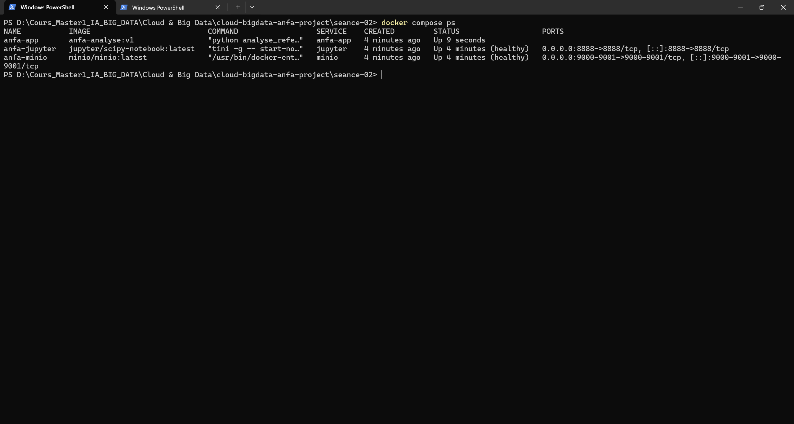
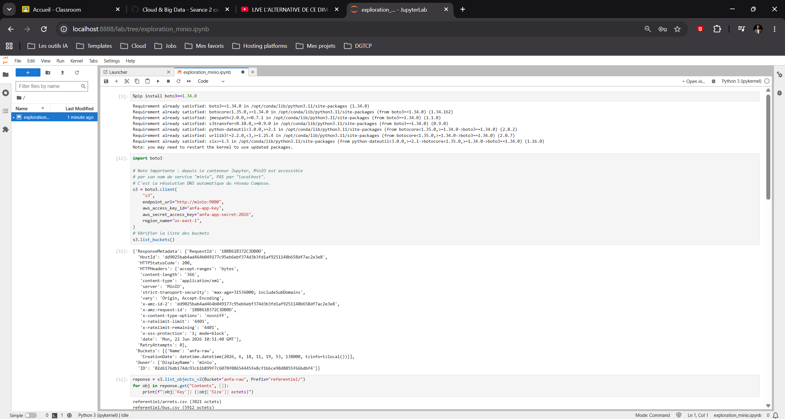
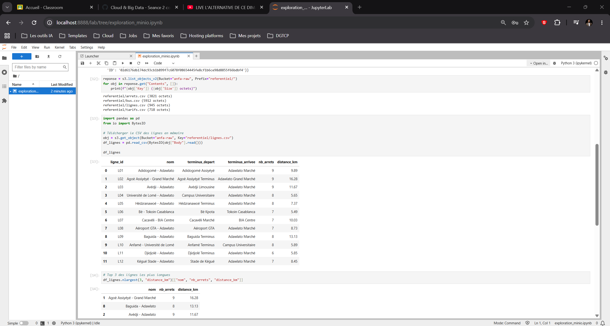

IMAGE             ID             DISK USAGE   CONTENT SIZE   EXTRA
anfa-analyse:v1   cc6b9caa99af       1.17GB          445MB

# Rendu - Séance 2
**Nom et prénom :** GBOSSOU Folly S. Carlo
**Identifiant GitHub :** davilla1993
**Date de soumission :** 22/06/2026

## Résumé de la séance
Lors de cette séance, j’ai conteneurisé une application PySpark en rédigeant un Dockerfile puis en construisant et exécutant l’image Docker correspondante. J’ai également mis en place les bonnes pratiques de build avec `.dockerignore` et le mécanisme de cache Docker.

J’ai ensuite orchestré un environnement multi-services composé de MinIO, Jupyter et de l’application Anfa à l’aide de Docker Compose. Enfin, j’ai créé un notebook Jupyter permettant de lire et d’explorer les données stockées dans MinIO via boto3 et pandas.

## Étapes principales
1. Écriture du Dockerfile et construction de l'image `anfa-analyse:v1` (taille observée : XX Go).
2. Mise en place du `.dockerignore` et observation du cache de Docker.
3. Écriture du `docker-compose.yml` orchestrant MinIO, Jupyter, et l'image custom.
4. Création du notebook `exploration_minio.ipynb` qui lit les données depuis MinIO via boto3 et pandas.
## Captures d'écran
### docker compose ps

### Notebook Jupyter

## Bonus multi-stage (optionnel)
Taille image v1: 
    - DISK USAGE: 1.17GB
    - CONTENT SIZE: 445MB

Taille image v2-multistage:  
    - DISK USAGE: 1.17GB
    - CONTENT SIZE: 445MB

Gain en pourcentage:

## Réponses aux exercices d'application
<À compléter d'après les énoncés fournis avec l'assignment.>

## Difficultés rencontrées
<Aucune | Décrivez brièvement.>