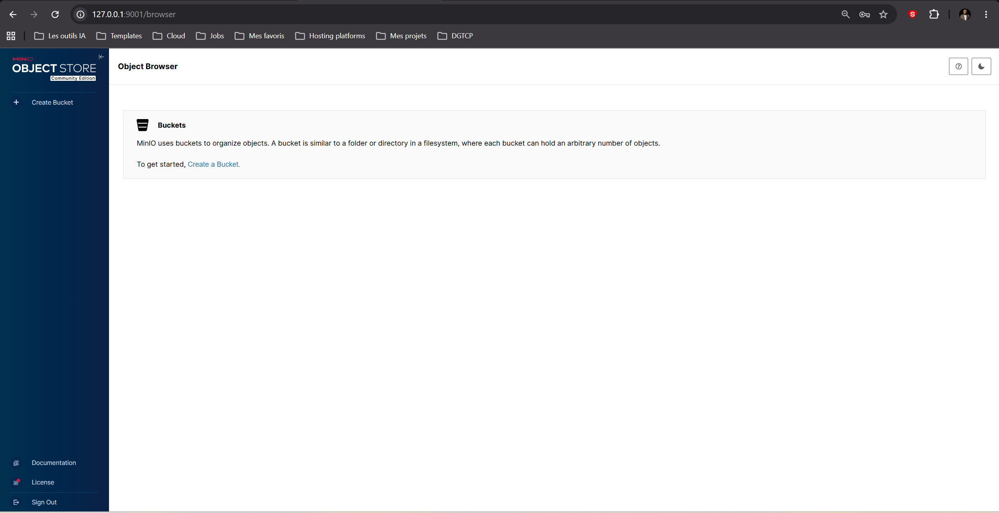
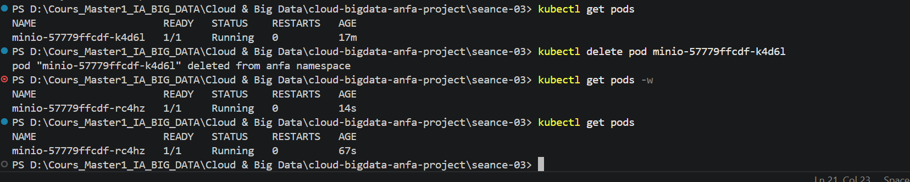
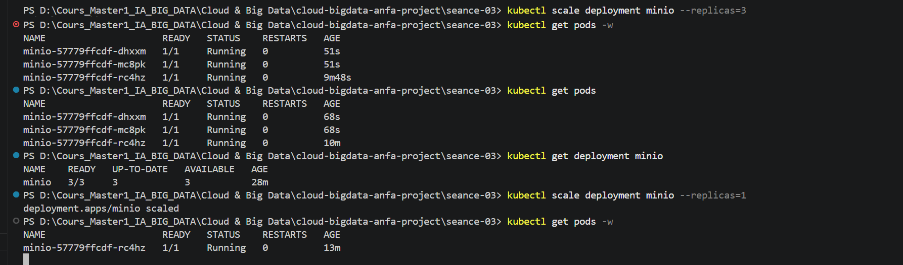

# Rendu Séance 3
**Nom et prénom :** GBOSSOU Folly S. Carlo
**Identifiant GitHub :** davilla1993
**Date de soumission :** 26/06/2026

## Résumé de la séance

Kind (Kubernetes IN Docker) a été installé et un cluster Kubernetes local nommé `anfa` a été créé avec ses nœuds tournant dans des conteneurs Docker. Le namespace `anfa` a été configuré comme contexte par défaut puis MinIO a été déployé via 3 manifestes YAML (PVC, Deployment, Service). Le self-healing a été observé concrètement après suppression manuelle d'un pod, le Deployment l'ayant recréé automatiquement en quelques secondes. Le scaling de 1 à 3 replicas puis le retour à 1 ont été effectués en une commande et l'Ingress Controller nginx a été activé dans le namespace `ingress-nginx`.

## Étapes principales

1. Installation de Kind et kubectl, création du cluster `anfa`.
2. Création du namespace `anfa` et configuration de kubectl.
3. Déploiement de MinIO via 3 manifestes YAML (PVC, Deployment, Service).
4. Observation du self-healing après suppression manuelle d'un pod.
5. Scaling du Deployment de 1 à 3 replicas, puis retour à 1.
6. Activation de l'Ingress Controller nginx.

## Captures d'écran

### Console MinIO accessible via port-forward


### Self-healing observé


### Scaling à 3 replicas


## Réponses aux exercices d'application

### Exercice 1 : QCM conceptuel

**1.1 → B**
Kubernetes orchestre des conteneurs sur un cluster de machines en s'appuyant sur un container runtime (containerd, Docker, CRI-O) ; il n'est pas lui-même un moteur de conteneurs.

**1.2 → B**
`etcd` est le magasin de données clé-valeur distribué qui stocke l'intégralité de l'état et de la configuration du cluster.

**1.3 → C**
Le Scheduler analyse les ressources disponibles sur chaque nœud et décide sur lequel placer chaque nouveau pod.

**1.4 → C**
Toutes les commandes `kubectl` transitent par l'API Server, qui est le seul point d'entrée du Control Plane.

**1.5 → B**
Le Controller Manager détecte l'écart entre l'état souhaité (1 replica) et l'état observé (0) et recrée immédiatement un nouveau pod — c'est le self-healing.

**1.6 → B**
NodePort expose le Service sur un port fixe (30000-32767) de chaque nœud du cluster, accessible depuis l'extérieur sans infrastructure cloud.

**1.7 → B**
`kubectl scale` met à jour la spec du Deployment dans etcd ; le Controller Manager crée ou supprime ensuite des pods pour converger vers le nombre souhaité.

**1.8 → B**
Un Namespace est une frontière logique qui regroupe et isole des ressources par équipe, environnement ou application, sans isolation réseau stricte.

**1.9 → B**
Kind crée chaque nœud Kubernetes comme un conteneur Docker basé sur l'image `kindest/node`, d'où son nom : *Kubernetes IN Docker*.

---

### Exercice 2 : Lecture et interprétation d'un manifeste

**2.1**
`selector.matchLabels` indique au Deployment quels pods il doit gérer : il sélectionne tous les pods portant les labels correspondants. `template.metadata.labels` définit les labels appliqués aux pods créés par ce Deployment. Les deux doivent correspondre exactement : si ce n'est pas le cas, le Deployment ne peut pas piloter ses propres pods.

**2.2**
2 pods seront créés (`replicas: 2`). Si l'un meurt, le Controller Manager détecte l'écart (1 pod observé vs 2 souhaités) et recrée automatiquement un pod pour retrouver l'état souhaité.

**2.3**
`minio` est le nom du Service Kubernetes qui expose MinIO dans le cluster. Kubernetes intègre CoreDNS : chaque Service obtient un nom DNS stable qui résout vers son ClusterIP, indépendamment des adresses IP des pods (qui changent à chaque redémarrage). Utiliser le nom du Service plutôt qu'une IP rend la configuration résiliente aux redémarrages de pods.

**2.4**
Sans Service, les pods de l'API ne sont accessibles que via leur IP de pod, qui est volatile et change à chaque redémarrage. Aucune autre application ni utilisateur externe ne peut joindre l'API de façon stable ou effectuer du load-balancing entre les 2 replicas.

**2.5**
```yaml
apiVersion: v1
kind: Service
metadata:
  name: anfa-api
  namespace: anfa
spec:
  type: ClusterIP
  selector:
    app: anfa-api
  ports:
    - port: 80
      targetPort: 8000
```

---

### Exercice 3 : Diagnostic

**3.1 — Le pod qui ne démarre pas**

**a.** `ImagePullBackOff` signifie que Kubernetes n'a pas réussi à télécharger l'image du conteneur depuis le registre. Il retente périodiquement avec un délai croissant (*backoff*).

**b.** La cause est une faute de frappe dans le nom de l'image : `minio/miniooo:latest` n'existe pas sur Docker Hub (le nom correct est `minio/minio`).

**c.** `kubectl describe pod minio-7d9f8b6c5-x2k9p` — la section `Events` en bas du résultat affiche le message d'erreur précis renvoyé par le registre.

---

**3.2 — Le PVC qui ne se lie pas**

**a.** `Pending` pour un PVC signifie que Kubernetes n'a pas encore trouvé (ou créé) de PersistentVolume capable de satisfaire la demande de stockage.

**b.** La cause la plus probable est que 500 Gi dépasse la capacité disponible sur le disque de la machine hôte. Le provisioner local de Kind crée des volumes dans le filesystem de l'hôte, mais ne peut pas allouer plus que l'espace disque réellement libre.

**c.** `kubectl describe pvc data-pvc` — la section `Events` indique si aucun PV ne correspond aux critères (capacité, mode d'accès, StorageClass).

---

**3.3 — Le port-forward qui échoue**

**a.** Le port-forward établit un tunnel réseau vers un processus en cours d'exécution dans le pod cible. Si le pod est en `Pending`, le conteneur n'a pas encore démarré et il n'y a aucun processus vers lequel rediriger le trafic.

**b.** `kubectl describe pod <nom-du-pod>` (section `Events`) pour voir pourquoi le pod reste en `Pending` : ressources insuffisantes, PVC non lié, image non trouvée, etc.

**c.** Ordre logique à respecter : 1) Vérifier que le PVC est `Bound` (`kubectl get pvc`) ; 2) Vérifier que le pod est `Running` (`kubectl get pods`) ; 3) Seulement alors lancer le `kubectl port-forward`.

---

### Exercice 4 : De Docker Compose à Kubernetes

**4.1**
3 manifestes Kubernetes distincts sont nécessaires :
- **PersistentVolumeClaim** (`minio-pvc.yaml`) : équivalent du volume nommé `minio-data`, il demande du stockage persistant au cluster.
- **Deployment** (`minio-deployment.yaml`) : équivalent du service `minio`, il décrit le pod (image, variables d'environnement, volume monté) et gère son cycle de vie.
- **Service** (`minio-service.yaml`) : équivalent du mapping `ports:`, il expose MinIO sur le réseau du cluster et vers l'extérieur via NodePort.

**4.2**
Un volume Docker nommé est géré directement par le daemon Docker sur la machine hôte : il est lié à une machine précise et n'est pas portable. Un PVC Kubernetes est une demande de stockage abstraite : Kubernetes choisit via un StorageClass et un provisioner comment et où créer le stockage réel (disque local, NFS, cloud...). Le PVC est découplé du pod — il survit à ses redémarrages et peut être réattaché à un nouveau pod, éventuellement sur un nœud différent.

**4.3**
Avec Docker Compose, le daemon Docker tourne sur l'hôte et mappe directement les ports du conteneur sur l'interface réseau de l'hôte (`0.0.0.0:9001`). Avec Kind, les nœuds Kubernetes sont eux-mêmes des conteneurs Docker : le NodePort est exposé sur le réseau interne de Docker, pas sur l'hôte. Pour un accès direct sans `port-forward`, il faudrait configurer Kind avec `extraPortMappings` dans son fichier de configuration au moment de la création du cluster, ou déployer un LoadBalancer comme MetalLB.

**4.4**
1. **Self-healing** : après suppression manuelle du pod MinIO, Kubernetes l'a recréé automatiquement en quelques secondes sans aucune intervention humaine — impossible nativement avec Docker Compose.
2. **Scaling déclaratif** : `kubectl scale deployment minio --replicas=3` a instancié 2 pods supplémentaires instantanément ; Kubernetes maintient en permanence cet état souhaité, contrairement à Docker Compose qui n'a pas de boucle de réconciliation.

---

### Exercice 5 : Mini-cas d'architecture

**5.1**
- **pipeline-anfa** → `CronJob` : la tâche doit s'exécuter automatiquement selon un planning (`0 2 * * *`), se terminer en ~15 minutes, et ne pas rester en permanence — c'est exactement le rôle d'un CronJob.
- **anfa-api** → `Deployment` : l'API doit être toujours disponible avec plusieurs replicas pour la haute disponibilité et le load-balancing ; un Deployment gère ce cycle de vie continu.
- **anfa-dashboard** → `Deployment` : le dashboard Grafana est une application web stateless consultée de façon continue ; un Deployment avec 1-2 replicas suffit pour la disponibilité standard.

**5.2**
- `minReplicas: 2` — garantit la disponibilité même hors pointe et tolère la perte d'un pod sans interruption.
- `maxReplicas: 10` — pour absorber les pics à ~50 req/s (en supposant ~5-10 req/s par replica selon le coût de chaque requête).
- Métrique cible : utilisation CPU à **60%**.
- Justification : avec 2 replicas au minimum, l'API absorbe le trafic de base (~5 req/s) avec de la marge. L'HPA monte automatiquement jusqu'à 10 replicas aux heures de pointe. Le seuil CPU à 60% laisse une marge de sécurité avant saturation et évite un scaling trop tardif.

**5.3**
**LoadBalancer** — l'API est exposée aux applications mobiles des conducteurs (trafic externe au cluster). Sur un cluster cloud managé, un Service LoadBalancer provisionne automatiquement un load-balancer cloud avec une IP publique stable, sans qu'on ait à gérer les ports ou les nœuds individuellement comme avec NodePort.

**5.4**
Par défaut Kubernetes utilise la stratégie **RollingUpdate** : lors d'une mise à jour, les nouveaux pods sont démarrés et attendent d'être prêts (`Ready`) avant que les anciens soient supprimés. Les paramètres `maxUnavailable: 0` et `maxSurge: 1` garantissent qu'au moins le nombre souhaité de replicas reste disponible en permanence. Le Service continue de router les requêtes vers les pods sains pendant toute la transition, sans coupure observable pour les clients.

**5.5**
```yaml
apiVersion: apps/v1
kind: Deployment
metadata:
  name: anfa-api
  namespace: anfa
spec:
  replicas: 3
  selector:
    matchLabels:
      app: anfa-api
  template:
    metadata:
      labels:
        app: anfa-api
    spec:
      containers:
        - name: api
          image: anfa/api:v1
          ports:
            - containerPort: 8000
          env:
            - name: MINIO_ENDPOINT
              value: "http://minio:9000"
```

---

## Difficultés rencontrées

Aucune difficulté majeure. Le seul point d'attention a été l'accès à la console MinIO via Kind : le NodePort n'est pas directement accessible depuis l'hôte, ce qui nécessite de passer par `kubectl port-forward` — comportement documenté dans le TP et bien expliqué par la nature des nœuds Kind (conteneurs Docker dans Docker).
