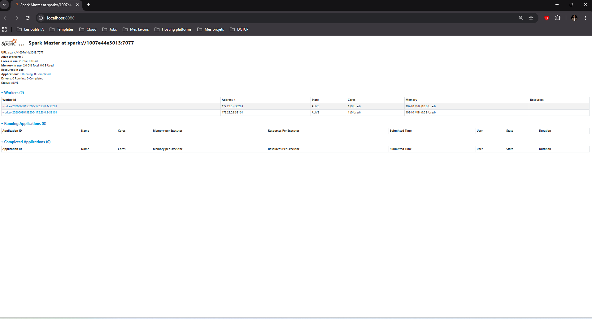
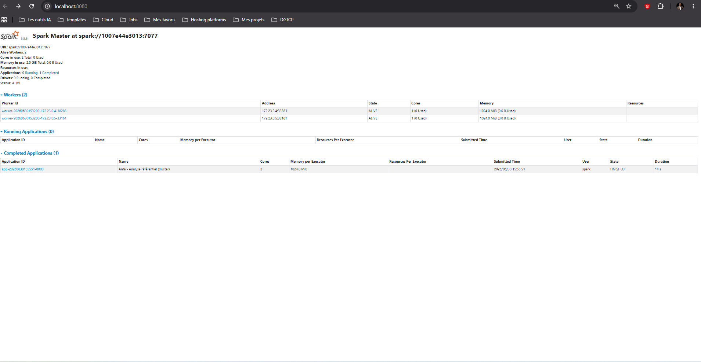
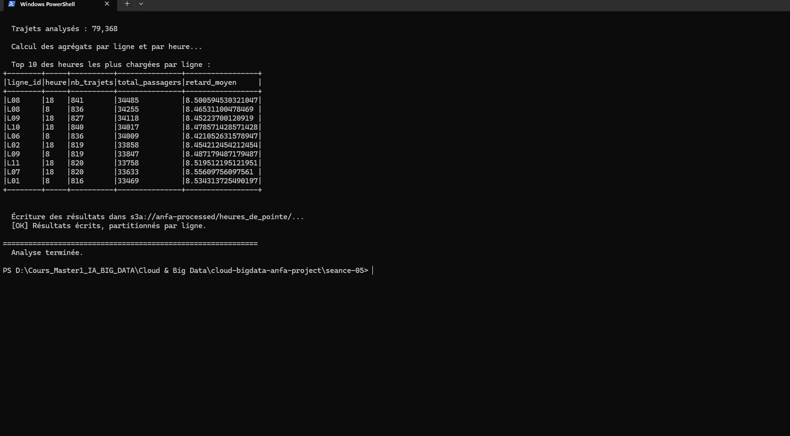
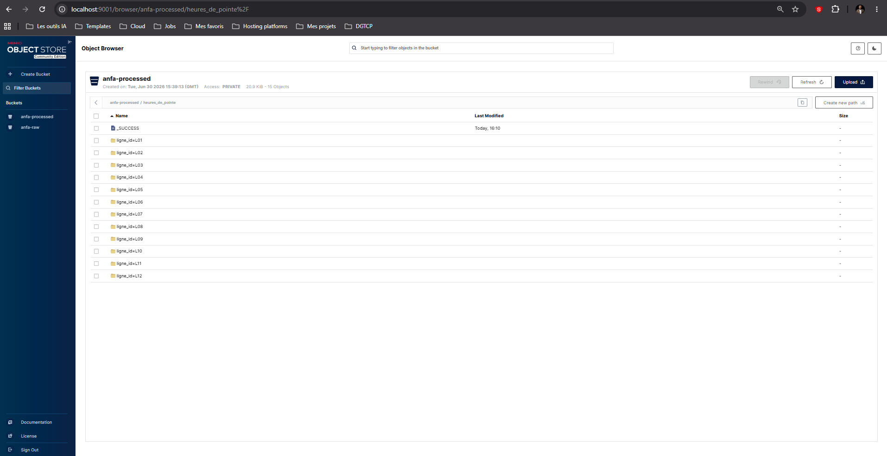

# Rendu Séance 5
**Nom et prénom :** GBOSSOU Folly S Carlo

## Résumé de la séance
Un cluster Spark standalone composé d'un master et de deux workers a été déployé via Docker Compose, aux côtés de MinIO comme stockage objet. Deux jobs PySpark distribués ont été soumis via `spark-submit` : le premier calcule des statistiques sur le référentiel Anfa (lignes, arrêts, bus) en lisant les CSV depuis MinIO via le connecteur S3A, le second analyse les heures de pointe sur un historique simulé de 75 000 trajets. Les résultats des deux jobs ont été écrits au format Parquet dans le bucket `anfa-processed`, avec partitionnement par ligne pour le job heures de pointe. La séance s'est conclue par une comparaison entre le mode local (séance 2) et le mode cluster.

## Étapes principales
1. Déploiement du cluster Spark standalone (1 master + 2 workers) via Docker Compose.
2. Préparation de MinIO et upload du référentiel.
3. Premier job distribué (`analyse_referentiel_cluster.py`) : statistiques de base.
4. Génération d'un historique simulé de trajets et job d'analyse des heures de pointe.
5. Comparaison subjective entre mode local et mode cluster.

## Captures d'écran

### Dashboard Spark Master avec 2 workers

### Application Spark exécutée avec succès

### Résultats du Top 10 dans la console

### Bucket anfa-processed avec heures_de_pointe partitionné

## Réflexion : local vs cluster
Sur un jeu de données de 75 000 trajets, le mode cluster s'est révélé **plus lent** que le mode local (environ 10-15 s contre 5-10 s). L'overhead de communication entre le Driver et les Executors (sérialisation, shuffle réseau) dépasse le gain du parallélisme à cette échelle. L'expérience est également plus complexe : il faut configurer l'endpoint S3A, gérer les dépendances Maven (`hadoop-aws`, `aws-java-sdk-bundle`) téléchargées au premier lancement, et surveiller l'UI Spark Master pour déboguer.

En revanche, le mode cluster devient **indispensable** dès que le volume de données dépasse la RAM d'une seule machine (au-delà de quelques centaines de millions de lignes), ou lorsque plusieurs jobs doivent tourner en parallèle. Pour le développement et les petits datasets, je continuerais à utiliser le mode `local[*]` ; pour la production ou les analyses sur des millions de trajets, le cluster Spark (standalone ou sur Kubernetes) s'impose.

## Bonus Spark sur Kubernetes
Réalisé : **oui**.

Démarche documentée dans [`bonus_spark_k8s.md`](bonus_spark_k8s.md) : création d'un cluster Kind `anfa`, installation du Spark Operator via Helm, construction d'une image Docker embarquant le job, déploiement de MinIO sur Kubernetes, puis soumission du job `heures_de_pointe.py` via un manifeste `SparkApplication` (CRD Spark Operator).

## Réponses aux exercices d'application (Enoncé non fourni)
<À compléter d'après les énoncés fournis avec l'assignment.>

## Difficultés rencontrées
- **Téléchargement des dépendances Maven** : le premier `spark-submit` avec `--packages hadoop-aws` a pris plusieurs minutes (résolution et téléchargement de `hadoop-aws` et `aws-java-sdk-bundle`). Résolu en utilisant `--conf spark.jars.ivy=/tmp/.ivy2` pour éviter les problèmes de droits liés à l'utilisateur sans home dans l'image officielle.
- **Variable `HOME` dans l'image apache/spark** : l'image tourne sous un utilisateur sans répertoire home, ce qui provoque des erreurs à l'installation de `boto3` (`pip install --user`) et au cache Maven. Résolu en passant `-e HOME=/tmp` à `docker exec`.
- **Configuration S3A** : la connexion de Spark à MinIO nécessite de désactiver SSL (`connection.ssl.enabled=false`) et d'activer le path-style access ; ces paramètres ne sont pas documentés dans les exemples Spark officiels et ont demandé quelques recherches.