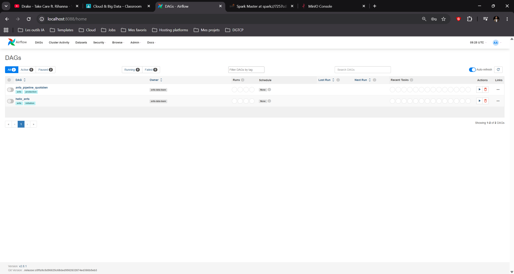
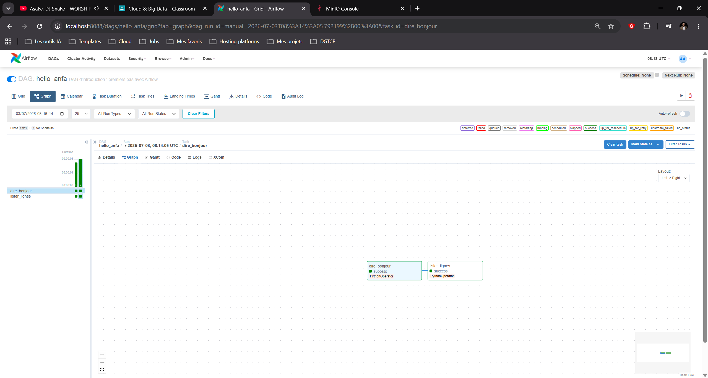
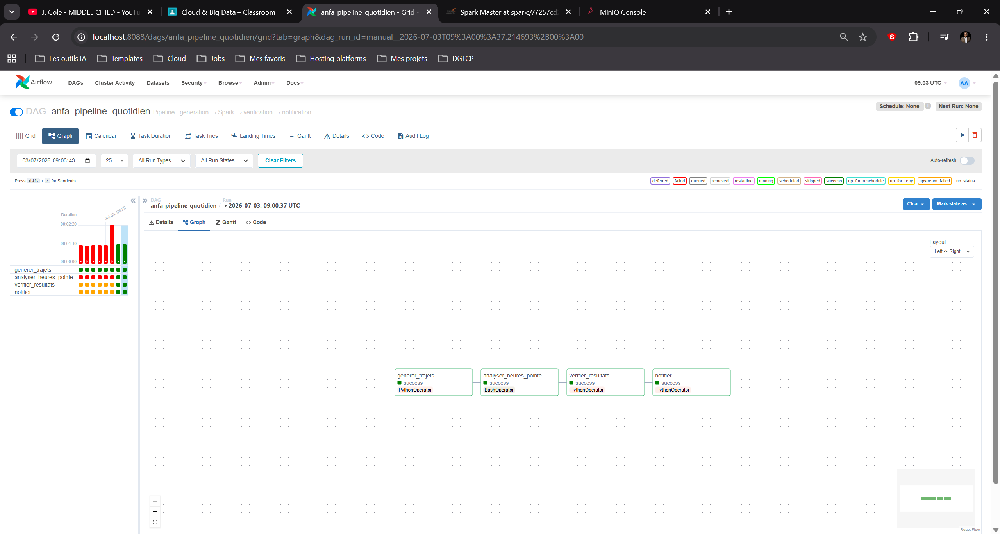
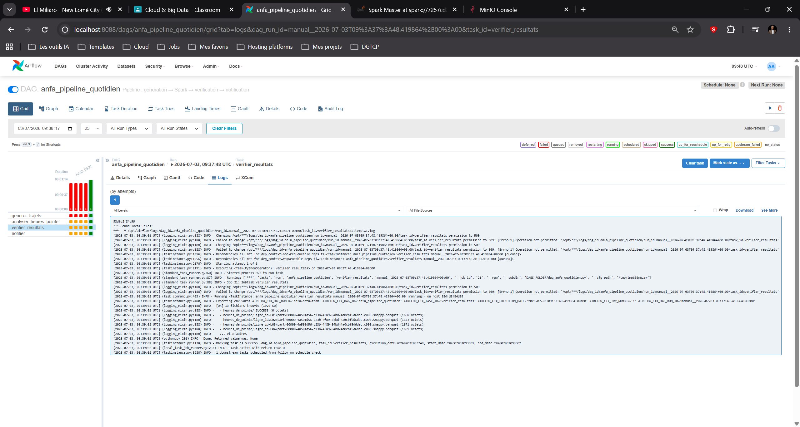
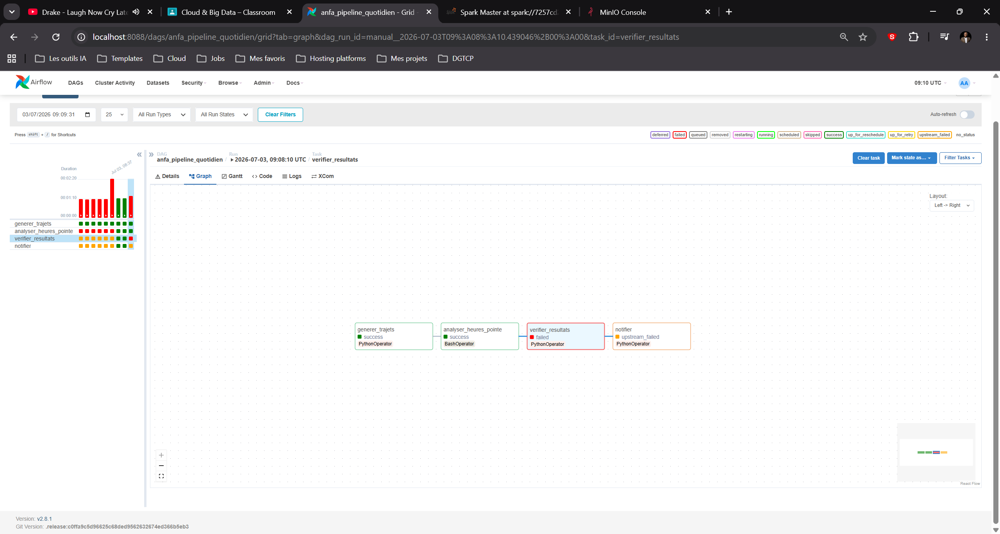

# Rendu : Séance 6

**Nom et prénom :** GBOSSOU Folly S. Carlo
**Identifiant GitHub :** davilla1993
**Date de soumission :** 03/07/2026

## Résumé de la séance

Airflow déployé via Docker Compose aux côtés de MinIO et Spark. Un premier DAG
simple (`hello_anfa`) a servi à comprendre la mécanique, puis un DAG métier
(`anfa_pipeline_quotidien`) orchestre le pipeline de la séance 5 :
génération → analyse Spark → vérification → notification. Les retries et la
propagation d'échec ont été observés via un bug volontaire.

## Étapes principales

1. Déploiement de la stack (Airflow + PostgreSQL + MinIO + Spark) via Docker Compose.
2. Premier DAG `hello_anfa` à 2 tâches : initiation à la mécanique Airflow.
3. DAG métier `anfa_pipeline_quotidien` à 4 tâches : génération → Spark → vérification → notification.
4. Démonstration des retries et de la gestion d'erreur via un bug volontaire.

## Captures d'écran

### UI Airflow après connexion (vue d'accueil)

### DAG hello_anfa exécuté en succès

### DAG anfa_pipeline_quotidien complet en succès

### Logs de la tâche `verifier_resultats`

### Démonstration du retry : tâche en échec et propagation

## Réflexion personnelle

Par rapport à un cron simple, Airflow apporte tout ce que cron ne sait pas faire :
la gestion des dépendances entre tâches (la vérification n'a de sens qu'après le job
Spark), les retries automatiques avec délai, l'arrêt du pipeline en cas d'échec au lieu
d'enchaîner sur des données invalides, et une UI qui centralise l'historique des runs et
les logs de chaque tâche — là où un cron échoue silencieusement. Sur un vrai projet, je
l'utiliserais dès qu'un pipeline enchaîne plusieurs étapes dépendantes (ingestion,
transformation, contrôle qualité, notification) et que l'équipe doit pouvoir diagnostiquer
et rejouer un run raté ; pour lancer un script isolé sans dépendances, un cron suffit.

## Difficultés rencontrées

Trois problèmes ont dû être résolus pour faire tourner le pipeline de bout en bout :

1. **PostgreSQL 18 refusait de démarrer** : depuis la version 18, l'image Docker
   attend le volume monté sur `/var/lib/postgresql` (le parent) et non plus sur
   `/var/lib/postgresql/data`. Correction du point de montage dans le compose.
2. **`JAVA_HOME is not set` sur la tâche Spark** : `spark-submit` en mode client
   fait tourner le driver dans le conteneur Airflow, qui n'a pas de JVM (pip
   n'installe que le client pyspark). Résolu avec une image personnalisée
   (`Dockerfile.airflow`) qui ajoute un JRE et `procps`.
3. **`InvalidClassException` à l'exécution du job** : le driver était en
   pyspark 3.5.0 alors que le cluster tourne en Spark 3.5.8 ; la sérialisation
   interne diffère entre versions de maintenance. Alignement de pyspark sur la
   version exacte du cluster (3.5.8) dans l'image.

Leçon retenue : dans une architecture distribuée, les versions de chaque composant
(driver/cluster, image/volume) doivent être alignées explicitement.
