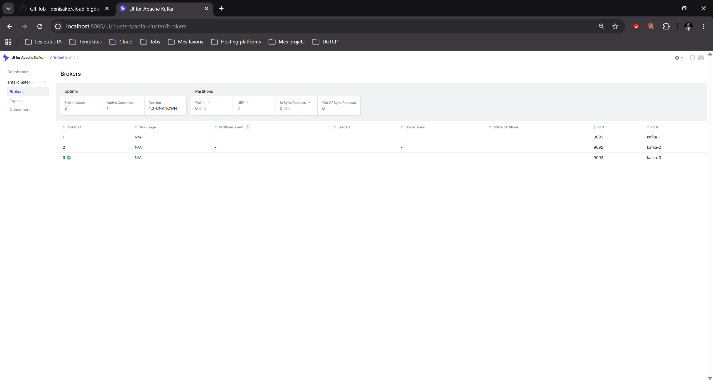
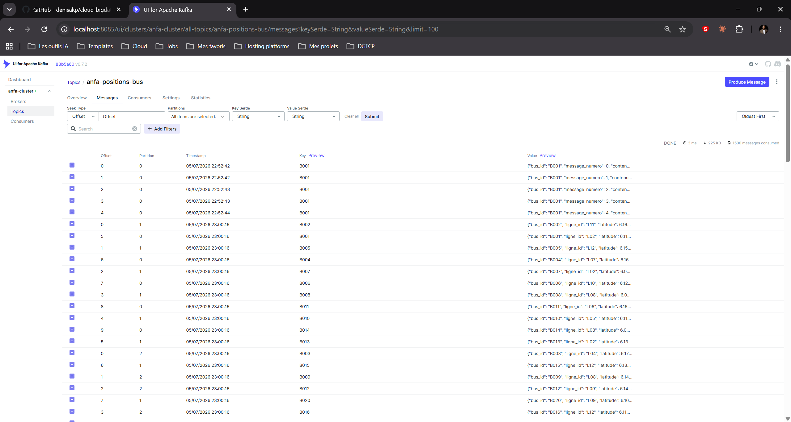
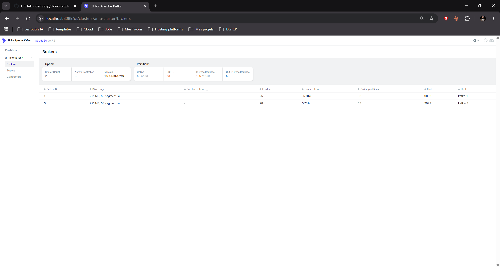
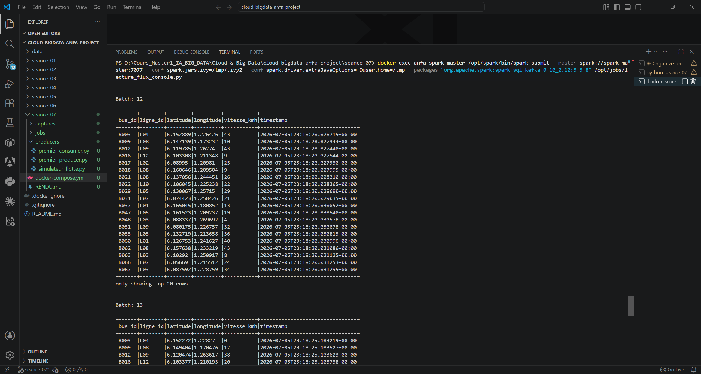
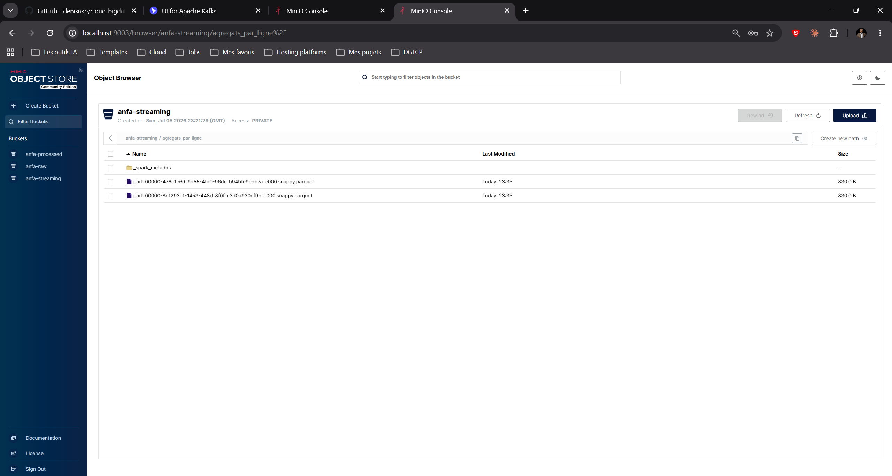

# Rendu — Séance 7

**Nom et prénom :** GBOSSOU Folly S. Carlo
**Identifiant GitHub :** davilla1993
**Date de soumission :** 05/07/2026

## Résumé de la séance

Un cluster Kafka 3 brokers en mode KRaft (sans ZooKeeper) a été déployé via Docker Compose,
avec un topic `anfa-positions-bus` répliqué sur les 3 nœuds. Un simulateur Python a produit
en continu les positions GPS de 100 bus Anfa (100 messages/seconde). Spark Structured
Streaming a d'abord affiché le flux en console (micro-batchs de 5 s), puis a calculé des
agrégats par fenêtre de 30 secondes et par ligne de bus, persistés au format Parquet dans MinIO.

## Étapes principales

1. Déploiement du cluster Kafka (3 brokers, mode KRaft) + Kafka UI.
2. Création du topic `anfa-positions-bus` (3 partitions, réplication 3).
3. Premier producer/consumer Python pour comprendre la mécanique.
4. Simulation de 100 bus envoyant leur position en continu.
5. Démonstration de tolérance aux pannes (arrêt d'un broker).
6. Spark Structured Streaming : lecture console, puis agrégation en fenêtre vers MinIO.

## Captures d'écran

### 3 brokers actifs dans Kafka UI

### Débit de messages en augmentation

### Cluster avec 2 brokers sur 3 (après arrêt volontaire)

### Micro-batchs affichés en console par Spark

### Résultats agrégés dans MinIO

## Réflexion personnelle

Kafka + Spark Structured Streaming est pertinent quand la latence est une contrainte métier :
localiser un bus en temps réel, détecter une anomalie de vitesse dès qu'elle se produit, ou
déclencher une alerte immédiate. Le pipeline batch Airflow + Spark vu en séances 5-6 convient
mieux aux traitements qui peuvent attendre (rapport quotidien, calcul de KPI de la nuit), car
il est plus simple à opérer et à rejouer en cas d'erreur.

La réplication à 3 brokers m'a montré concrètement que l'arrêt d'un nœud n'interrompt pas la
production ni la consommation : Kafka réélit un leader sur les deux brokers restants et le
topic reste accessible. Avec `min.insync.replicas=2`, les messages écrits sont garantis sur
au moins 2 nœuds avant que le producer reçoive l'acquittement, ce qui rend le cluster
tolérant à une panne simple sans perte de données.

## Réponses aux exercices d'application

*Les énoncés spécifiques n'ont pas été fournis avec ce rendu ; cette section sera complétée
dès réception des questions officielles de l'assignment.*

## Difficultés rencontrées

**Conflit de ports MinIO** : le conteneur `anfa-minio` ne pouvait pas exposer les ports 9000-9001
sur l'hôte car un autre projet les occupait déjà. Résolu en remappant vers 9002/9003 dans le
`docker-compose.yml` (les connexions internes Docker `minio:9000` ne sont pas affectées).

**Job Spark en attente de ressources** : une deuxième soumission du `spark-submit` restait bloquée
sur `Initial job has not accepted any resources`. Cause : l'exécuteur de la première soumission
(non arrêtée proprement) monopolisait l'unique core du worker. Résolu en killant le processus
driver orphelin dans le conteneur `anfa-spark-master`, ce qui a libéré le core et permis au
nouveau job d'être schedulé immédiatement.
