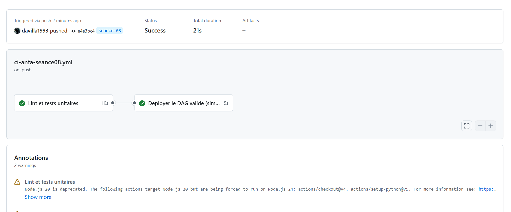
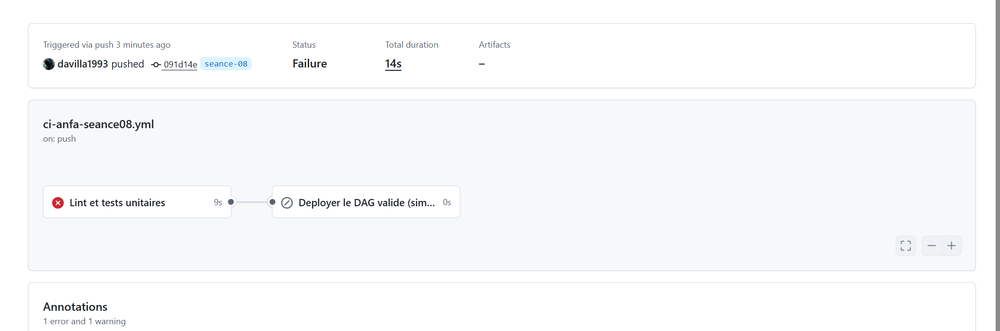

# Rendu — Séance 8

**Nom et prénom :** GBOSSOU Folly Sitou Carlo
**Identifiant GitHub :** davilla1993
**Date de soumission :** 06/07/2026

## Résumé de la séance

La logique métier du DAG Airflow (séance 6) a été extraite dans un module Python indépendant (`anfa_logic.py`), testable sans installer Airflow. Cinq tests unitaires ont été écrits avec pytest pour valider les fonctions `construire_cle_trajets`, `verifier_liste_fichiers` et `construire_message_notification`. Un workflow GitHub Actions a été mis en place pour exécuter automatiquement le lint (flake8) et les tests à chaque push sur la branche `seance-08`. La démonstration d'un bug volontaire (division par 1000 au lieu de 1024) a permis d'observer concrètement le pipeline bloquer le job de déploiement lorsqu'un test échoue.

## Étapes principales

1. Séparation de la logique métier (`anfa_logic.py`) du DAG Airflow.
2. Écriture de 5 tests unitaires avec pytest.
3. Écriture du workflow GitHub Actions (lint + tests + déploiement simulé).
4. Démonstration : un bug volontaire bloque le déploiement ; correction et succès.

## Captures d'écran

### Workflow réussi (2 jobs)

### Job en échec, déploiement non exécuté

## Réflexion personnelle

L'incident de Mawuli illustre le risque d'un déploiement manuel sans validation automatisée : il a copié directement un fichier corrigé sur le serveur Airflow de production, sans que personne ne le relise et sans exécuter de tests dans un environnement identique à la production. Une variable d'environnement présente sur son poste mais absente du serveur a provoqué une erreur silencieuse, et le pipeline de la nuit a échoué. Avec le workflow CI mis en place lors de cette séance, ce scénario aurait été bloqué dès le push : flake8 aurait détecté tout problème de syntaxe, et pytest aurait levé une erreur si une fonction utilisait une variable d'environnement non définie dans les tests. Le mot-clé `needs: valider-dag` est la garantie centrale de ce mécanisme : le job `deployer` ne démarre que si le job `valider-dag` s'est terminé avec succès. Si les tests échouent, le déploiement n'est tout simplement pas exécuté — indépendamment de la volonté de l'opérateur. Mawuli aurait vu son push refusé dans la Pull Request, et aucun collègue n'aurait pu merger du code non validé vers la production.

## Difficultés rencontrées

Le pipeline ne se déclenchait pas après le premier push. La cause était double : d'une part, le fichier workflow `.github/workflows/ci-anfa-seance08.yml` n'existait que sur la branche `main` et non sur `seance-08` — GitHub Actions lit le workflow depuis la branche cible du push, pas depuis main. D'autre part, le filtre `paths: ["seance-08/**"]` imposait qu'au moins un fichier du répertoire `seance-08/` soit modifié dans le push pour déclencher la CI ; pousser uniquement le fichier workflow (situé dans `.github/`) ne suffisait pas. La solution a été d'ajouter le workflow directement sur la branche `seance-08`, puis de pousser une modification dans `seance-08/` pour activer le déclencheur.
