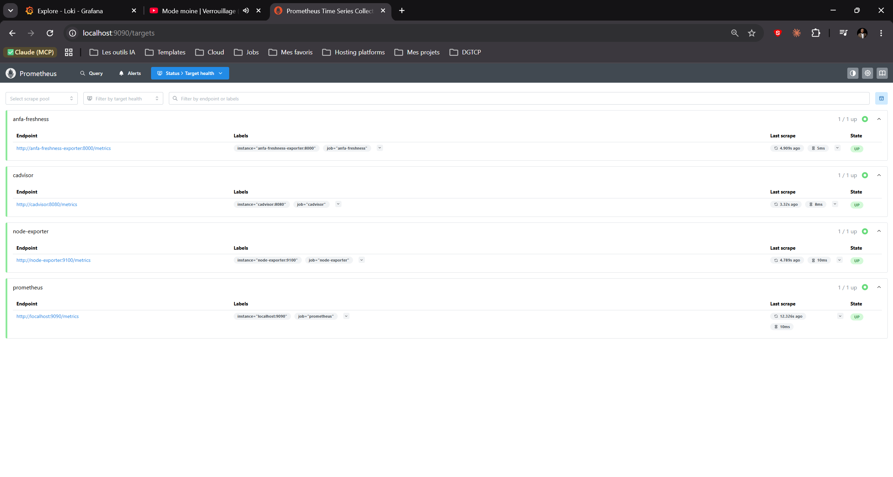
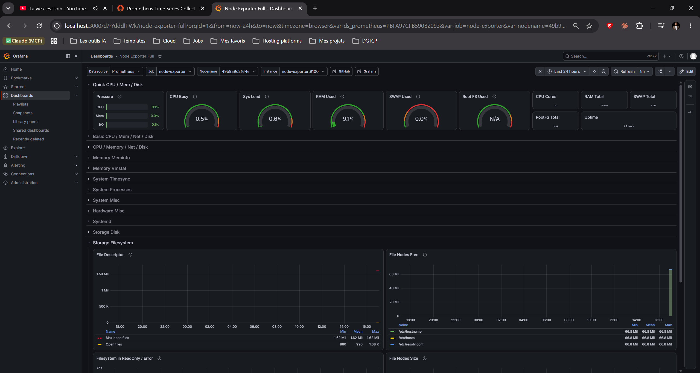
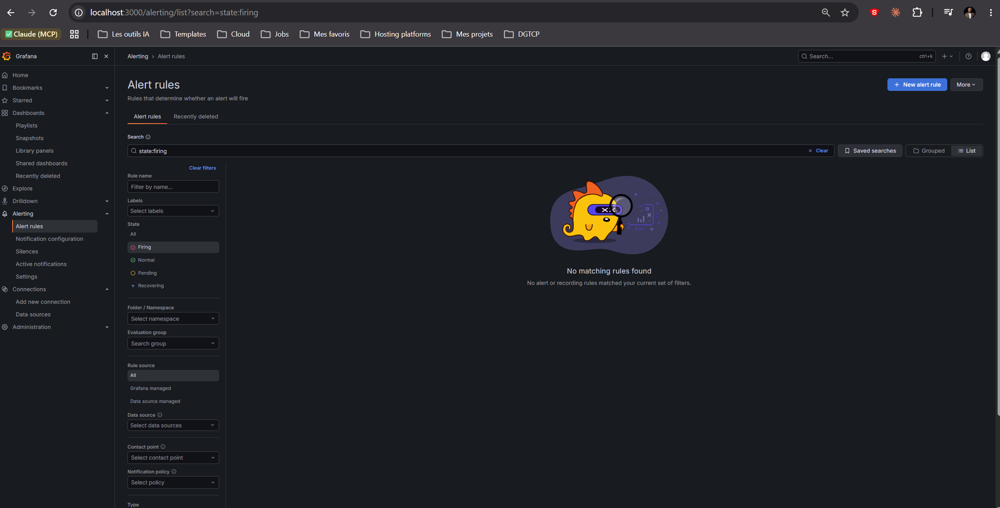

# Rendu — Séance 9

**Nom et prénom :** GBOSSOU Folly S Carlo
**Identifiant GitHub :** davilla1993
**Date de soumission :** 07/07/2026

## Résumé de la séance

Une stack de monitoring complète a été déployée via Docker Compose (Prometheus, Node Exporter, cAdvisor, Grafana et un exportateur métier custom). Un exportateur Python expose la métrique `anfa_dernier_traitement_timestamp` pour mesurer la fraîcheur des données Anfa. Un panneau Grafana visualise cette fraîcheur via la requête PromQL `time() - anfa_dernier_traitement_timestamp`, et une règle d'alerte se déclenche automatiquement si la fraîcheur dépasse 90 secondes, simulant exactement le scénario d'incident décrit dans le CM.

## Étapes principales

1. Déploiement de Prometheus, Node Exporter, cAdvisor, Grafana et d'un exportateur
   métier custom (fraîcheur des données Anfa).
2. Exploration des cibles Prometheus et premières requêtes PromQL.
3. Import du dashboard "Node Exporter Full" et construction d'un panneau custom.
4. Configuration d'une alerte Grafana sur la fraîcheur des données.
5. Simulation d'une panne silencieuse et observation du déclenchement de l'alerte.

## Captures d'écran

### Les 4 cibles Prometheus à l'état UP

### Dashboard "Node Exporter Full" importé

### Alerte à l'état Firing après panne simulée

## Réflexion personnelle

Cette séance répond directement à la situation d'Awa : son pipeline s'était silencieusement arrêté sans que les métriques classiques (CPU bas, RAM stable, conteneurs UP) ne montrent quoi que ce soit d'anormal. La métrique de fraîcheur `time() - anfa_dernier_traitement_timestamp` permet de détecter précisément ce cas invisible : le système tourne, mais ne produit plus de données. Les métriques système surveillent la machine, la métrique métier surveille le résultat attendu du traitement. Sans cette distinction, une panne silencieuse peut passer inaperçue pendant des heures, comme ce fut le cas pour Awa. L'alerte configurée sur un seuil de 90 secondes aurait permis une notification immédiate dès l'arrêt du pipeline.

## Difficultés rencontrées

L'interface de Grafana 13 a sensiblement changé par rapport aux versions documentées dans le TP : le bouton "Add visualization" n'apparaît qu'après avoir sélectionné un layout, et l'éditeur de requêtes nécessite de basculer en mode "Code" pour saisir du PromQL brut. La configuration de l'alerte a également demandé une adaptation : la section "Condition" correspond à la section "Expressions" dans Grafana 13, et la liste des contact points était vide par défaut (aucun `grafana-default-email` précréé), ce qui n'a pas empêché la sauvegarde de la règle ni l'observation du changement d'état de l'alerte.
