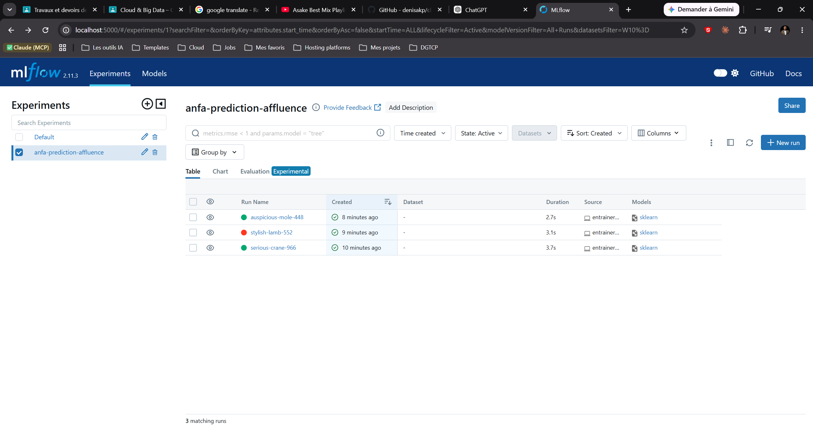
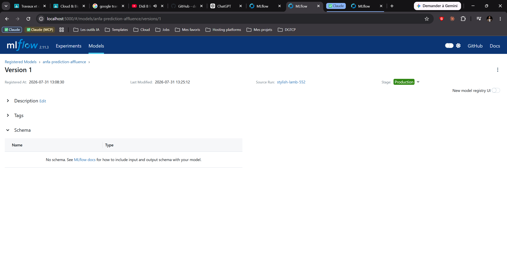
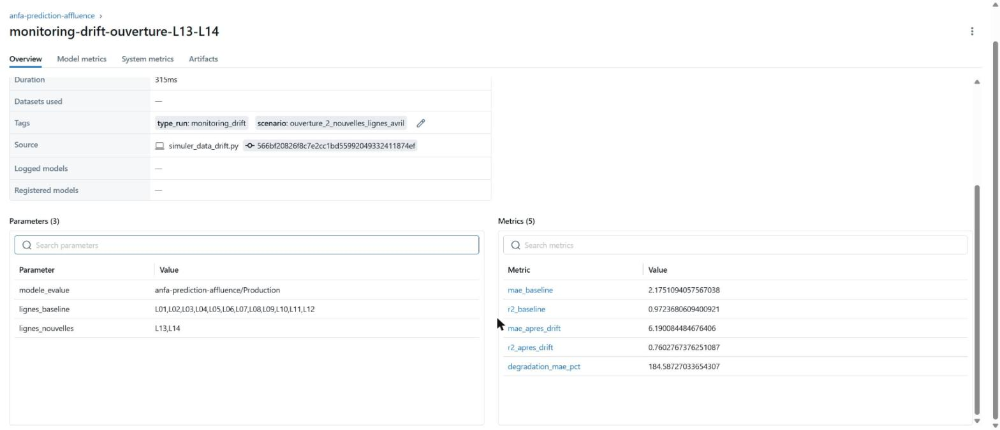

# Rendu — Séance 10

**Nom et prénom :** GBOSSOU Folly S. Carlo
**Identifiant GitHub :** davilla1993
**Date de soumission :** 31/07/2026

## Résumé de la séance

Un serveur MLflow Tracking a été déployé via Docker Compose (SQLite + stockage local des artefacts).
Trois variantes d'un modèle RandomForest prédisant l'affluence par ligne ont été entraînées et tracées
(run `stylish-lamb-552` retenu comme meilleur candidat), comparées dans l'UI, puis la meilleure version
a été enregistrée dans le Model Registry sous le nom `anfa-prediction-affluence` et basculée en statut
Production. Une fiche de conformité non-technique a également été rédigée pour un scénario d'application
mobile Anfa.

## Étapes principales

1. Déploiement d'un serveur MLflow Tracking (SQLite + stockage local).
2. Génération d'un jeu de données d'affluence Anfa et entraînement de 3 variantes
   d'un modèle RandomForest, chacune tracée avec MLflow.
3. Comparaison des runs dans l'UI et identification du meilleur candidat.
4. Enregistrement du modèle dans le Model Registry, transition en statut Production.
5. Rédaction d'une fiche de conformité pour un scénario d'application mobile Anfa.

## Captures d'écran

### Tableau des 3 runs comparés

### Modèle enregistré en statut Production

## Réflexion personnelle

Le problème de Kossi (CM) n'est pas que son modèle plante, mais qu'il tourne sans erreur tout en se
dégradant silencieusement, sans que personne ne puisse dire avec certitude quelle version est réellement
en production ni la comparer à une alternative. Le Model Registry répond exactement à ça : chaque version
est tracée avec son statut (Staging/Production/Archived), donc on sait toujours ce qui sert réellement
les prédictions, et on peut revenir en arrière si une nouvelle version déçoit. C'est le même principe que
`git revert` (séance 1) ou qu'un `terraform.tfstate` qui recrée un état antérieur (séance 4) : dans les
trois cas, on gouverne en gardant la trace d'un état plutôt qu'en faisant confiance de mémoire.

## Pour aller plus loin : simulation de data drift

Pour vérifier concrètement le problème de Kossi (CM), un script `scripts/simuler_data_drift.py` charge
le modèle `anfa-prediction-affluence/Production` depuis le Registry et l'évalue sur deux jeux de
données : un jeu « baseline » avec les 12 lignes connues à l'entraînement, et un jeu simulant l'ouverture
de 2 nouvelles lignes (L13, L14) « en avril », jamais vues par le modèle. Résultat :

| | MAE | R² |
|---|---|---|
| Baseline (12 lignes connues) | 2.18 | 0.972 |
| Après ouverture de L13/L14 | 6.19 | 0.760 |

Le MAE se dégrade de **+184,6 %** sans qu'aucune exception ne soit levée : le `OneHotEncoder` du
pipeline (`handle_unknown="ignore"`) encode silencieusement les nouvelles lignes à zéro plutôt que de
planter, donc le modèle continue de répondre — juste de moins en moins bien. Le run est loggé dans
MLflow sous le nom `monitoring-drift-ouverture-L13-L14` avec les 5 métriques de comparaison, consultable
dans l'UI comme n'importe quel autre run.

## Difficultés rencontrées

L'installation de `mlflow==2.11.3` a échoué initialement car `numpy<2` (dépendance imposée par cette
version de mlflow) n'a pas de wheel précompilé pour Python 3.13, et aucun compilateur C n'était disponible
sur la machine pour le construire depuis les sources. Résolu en créant un environnement virtuel dédié sous
Python 3.11 (qui dispose de wheels précompilés pour toute la stack). Par ailleurs, le menu "Stage" décrit
dans le TP n'apparaissait pas dans l'UI Registry : il était masqué par le toggle "New model registry UI"
(nouvelle UI basée sur les aliases plutôt que les stages) — désactiver ce toggle a fait réapparaître le
menu Stage classique utilisé pour la transition vers Production.
